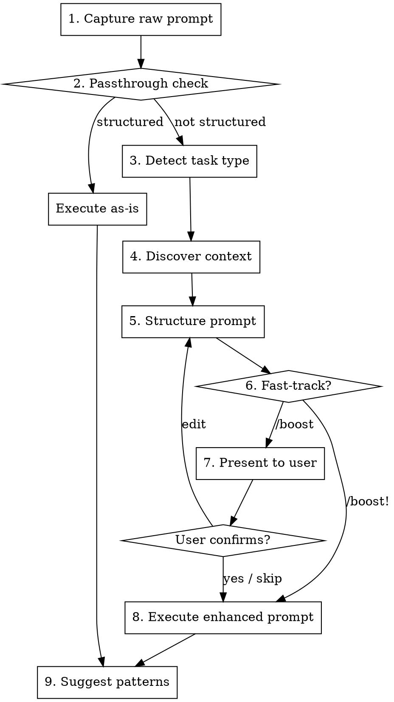

# Boost v2 Premium Plugin Implementation Plan

> **For agentic workers:** REQUIRED SUB-SKILL: Use superpowers:subagent-driven-development (recommended) or superpowers:executing-plans to implement this plan task-by-task. Steps use checkbox (`- [ ]`) syntax for tracking.

**Goal:** Restructure the boost skill into a premium, marketplace-publishable plugin following the Agent Skills spec with progressive disclosure, defensive design, eval framework, and full packaging.

**Architecture:** Single `skills/boost/` directory with lean SKILL.md (<150 words) as trigger, all logic in reference files loaded on demand. Marketplace packaging via package.json and .claude-plugin/marketplace.json. Eval framework in tests/ directory. Platform-agnostic (no .claude/ or .cursor/ specific dirs).

**Tech Stack:** Markdown (SKILL.md format), YAML frontmatter, JSON (package.json, marketplace.json)

---

## File Structure

```
boost/                                    # Plugin root (replaces current project root)
  package.json                            # Plugin metadata
  LICENSE                                 # MIT license
  README.md                               # Marketplace description + usage guide
  CLAUDE.md                               # Contributor conventions
  .claude-plugin/
    marketplace.json                      # Claude Code marketplace listing
  skills/
    boost/
      SKILL.md                            # Lean trigger-only (~40 lines)
      references/
        flow.md                           # Full 9-step process with flowchart
        task-templates.md                 # 7 templates with before/after + anti-patterns
        context-discovery.md              # 4-priority discovery + edge cases + secrets avoidance
        red-flags.md                      # Iron laws + rationalization prevention + DO NOTs
        prompt-passthrough.md             # Already-structured prompt detection
      examples/
        before-after.md                   # 7 complete raw→boosted transformations
  tests/
    eval-triggers.md                      # 20 trigger/no-trigger test scenarios
    eval-quality.md                       # Quality grading rubric
  patterns/
    boost-patterns.md                     # Starter template for users
```

**Migration note:** All v1 files under `.claude/skills/boost/`, `.cursor/skills/boost/`, and `.cursor/rules/boost.mdc` will be removed. The new structure lives at the project root as a standalone plugin.

---

### Task 1: Clean Up v1 Files and Restructure Directories

**Files:**
- Remove: `.claude/skills/boost/` (entire directory)
- Remove: `.cursor/skills/boost/` (entire directory)
- Remove: `.cursor/rules/boost.mdc`
- Remove: `boost-patterns.md` (will be recreated at `patterns/boost-patterns.md`)
- Create directories for v2 structure

- [ ] **Step 1: Remove v1 skill files**

```bash
rm -rf .claude/skills/
rm -rf .cursor/
rm -f boost-patterns.md
```

- [ ] **Step 2: Create v2 directory structure**

```bash
mkdir -p skills/boost/references
mkdir -p skills/boost/examples
mkdir -p tests
mkdir -p patterns
mkdir -p .claude-plugin
```

- [ ] **Step 3: Commit**

```bash
git add -A
git commit -m "chore: remove v1 skill files, create v2 directory structure"
```

---

### Task 2: Create Package Metadata and Licensing

**Files:**
- Create: `package.json`
- Create: `LICENSE`
- Create: `.claude-plugin/marketplace.json`

- [ ] **Step 1: Create package.json**

```json
{
  "name": "boost",
  "version": "1.0.0",
  "description": "Prompt enhancer skill — transforms rough prompts into structured, context-rich prompts before execution. Just add /boost to any prompt.",
  "license": "MIT",
  "author": "Sanjay Kumar",
  "keywords": [
    "claude-code-plugin",
    "agent-skill",
    "prompt-engineering",
    "prompt-enhancer",
    "boost",
    "cursor",
    "gemini",
    "codex"
  ],
  "type": "module",
  "repository": {
    "type": "git",
    "url": ""
  }
}
```

- [ ] **Step 2: Create LICENSE**

Create a standard MIT license file with:
- Year: 2026
- Copyright holder: Sanjay Kumar

Full MIT license text:

```
MIT License

Copyright (c) 2026 Sanjay Kumar

Permission is hereby granted, free of charge, to any person obtaining a copy
of this software and associated documentation files (the "Software"), to deal
in the Software without restriction, including without limitation the rights
to use, copy, modify, merge, publish, distribute, sublicense, and/or sell
copies of the Software, and to permit persons to whom the Software is
furnished to do so, subject to the following conditions:

The above copyright notice and this permission notice shall be included in all
copies or substantial portions of the Software.

THE SOFTWARE IS PROVIDED "AS IS", WITHOUT WARRANTY OF ANY KIND, EXPRESS OR
IMPLIED, INCLUDING BUT NOT LIMITED TO THE WARRANTIES OF MERCHANTABILITY,
FITNESS FOR A PARTICULAR PURPOSE AND NONINFRINGEMENT. IN NO EVENT SHALL THE
AUTHORS OR COPYRIGHT HOLDERS BE LIABLE FOR ANY CLAIM, DAMAGES OR OTHER
LIABILITY, WHETHER IN AN ACTION OF CONTRACT, TORT OR OTHERWISE, ARISING FROM,
OUT OF OR IN CONNECTION WITH THE SOFTWARE OR THE USE OR OTHER DEALINGS IN THE
SOFTWARE.
```

- [ ] **Step 3: Create .claude-plugin/marketplace.json**

```json
{
  "name": "boost",
  "title": "Boost — Prompt Enhancer",
  "description": "Transform rough prompts into structured, context-rich prompts. Just add /boost to any prompt. Detects task type, discovers project context, and structures your prompt with the right template — debug, feature, refactor, test, review, docs, or general.",
  "category": "productivity",
  "skills": ["boost"]
}
```

- [ ] **Step 4: Commit**

```bash
git add package.json LICENSE .claude-plugin/marketplace.json
git commit -m "feat: add package metadata, MIT license, and marketplace listing"
```

---

### Task 3: Create the Lean SKILL.md

**Files:**
- Create: `skills/boost/SKILL.md`

This is the lean trigger file — under 150 words. All logic lives in reference files.

- [ ] **Step 1: Create SKILL.md**

```markdown
---
name: boost
description: Use when user appends or prefixes /boost or /boost! to their prompt. Restructures rough prompts into clear, structured, context-rich prompts before execution.
user-invokable: true
---

# Boost — Prompt Enhancer

Transform rough prompts into structured, context-rich prompts before execution.

## Invocation

- **Prefix:** `/boost refactor the auth module`
- **Suffix:** `refactor the auth module /boost`
- **Fast-track:** `refactor the auth module /boost!` (skip confirmation)

## Process

Read `references/flow.md` for the complete enhancement process.

1. CAPTURE — strip /boost trigger
2. PASSTHROUGH CHECK — already structured? (`references/prompt-passthrough.md`)
3. DETECT — classify task type
4. DISCOVER — read project context (`references/context-discovery.md`)
5. STRUCTURE — apply template (`references/task-templates.md`)
6. PRESENT — show enhanced prompt
7. DECIDE — confirm, edit, skip, or auto-execute
8. EXECUTE — work on the structured prompt
9. SUGGEST — offer pattern additions

## Iron Laws

Read `references/red-flags.md` before proceeding. Non-negotiable.
```

- [ ] **Step 2: Verify word count is under 150**

```bash
wc -w skills/boost/SKILL.md
```

Expected: Under 150 words (excluding frontmatter).

- [ ] **Step 3: Commit**

```bash
git add skills/boost/SKILL.md
git commit -m "feat(boost): add lean trigger-only SKILL.md (<150 words)"
```

---

### Task 4: Create references/flow.md — Complete Process

**Files:**
- Create: `skills/boost/references/flow.md`

The full 9-step process with graphviz flowchart, edge cases per step, and integration section.

- [ ] **Step 1: Create flow.md**

```markdown
# Boost — Complete Process

## Flow



## Step 1: Capture

Strip `/boost` or `/boost!` from the user's input. The remaining text is the raw prompt.

- If `/boost!` was used → fast-track mode ON (skip confirmation in Step 7)
- If `/boost` was used → fast-track mode OFF (show confirmation)
- Handle both prefix and suffix positions
- Case-insensitive: `/BOOST`, `/Boost` all work

**Edge cases:**
- Empty prompt after stripping → Ask: "What would you like to do?"
- Multiple `/boost` in prompt → Strip only the first occurrence
- `/boost` appears as part of a word (e.g., `/booster`) → Do NOT trigger

## Step 2: Passthrough Check

Read `references/prompt-passthrough.md` for detection rules.

If the prompt is already well-structured (meets 3+ criteria), skip to Step 8 with message:

"Your prompt is already well-structured. Executing as-is."

If partially structured (1-2 criteria), run the full enhancement flow — existing structure will be preserved and enriched.

## Step 3: Detect Task Type

Scan the raw prompt for keywords (case-insensitive):

| Category | Keywords |
|----------|----------|
| Debug | fix, bug, broken, error, not working, crash, failing, issue |
| Feature | add, create, build, implement, new, make, setup, introduce |
| Refactor | refactor, clean up, reorganize, simplify, messy, restructure, improve, optimize |
| Test | test, coverage, spec, assert, unit test, integration test |
| Review | review, check, audit, look at, examine, inspect |
| Docs | document, readme, explain, comment, describe, write docs |
| General | (fallback — no keywords matched) |

**Detection rules:**
- Count keyword matches per category (case-insensitive)
- Highest count wins
- Tie-breaking priority: Debug > Feature > Refactor > Test > Review > Docs > General
- Debug is highest because "fix" and "error" co-occur with other categories but debugging is almost always the primary intent

**Edge case:** If the raw prompt describes two distinct tasks (e.g., "fix the login bug and add dark mode"), tell the user: "This looks like two separate tasks. Want me to boost them individually?"

## Step 4: Discover Context

Read `references/context-discovery.md` for the full discovery rules.

**Quick summary — 4 priorities:**
1. **Project config** (always) — instruction files, package manifests, style configs
2. **Git context** (if available) — recent commits, changed files, branch name
3. **File structure** (if prompt mentions modules) — directory listing, file previews
4. **Team patterns** (always) — boost-patterns.md from project root

Stay within ~2000 line budget.

**Track unresolved terms** for Step 9: module/component names that could not be resolved to file paths or aliases.

## Step 5: Structure the Prompt

Read `references/task-templates.md` and select the template matching the detected task type.

Fill in every field:
- **Task:** Rewrite the raw prompt as a clear one-line summary
- **Type:** The detected category name
- **Context:** Populate from discovered project context
- **Category-specific sections:** Fill using raw prompt + discovered context
- **Constraints:** Combine project conventions + task-type defaults
- **Success Criteria:** Derive measurable outcomes from the task

If a field cannot be filled → write "Unknown — investigate" (never omit, never guess).

## Step 6: Present

Display the enhanced prompt prefixed with:

**Boost enhanced your prompt:**

## Step 7: Decide

**Fast-track ON** (`/boost!`): Skip confirmation, proceed to Step 8.

**Fast-track OFF** (`/boost`): Ask: "Execute this enhanced prompt? (yes / edit / skip)"
- **yes / y** → proceed to Step 8
- **edit** → user modifies, incorporate changes, proceed to Step 8
- **skip / s** → proceed to Step 8 immediately (mid-flow fast-track)

## Step 8: Execute

Execute the structured prompt as if the user had typed it directly.

**IMPORTANT:** Do NOT re-announce the prompt. Just begin working on the task.

## Step 9: Suggest Pattern Additions

After execution completes, if unresolved terms exist (from Step 4):

1. Collect up to 3 unresolved terms
2. Present:
   ```
   Boost noticed terms it could add to your team patterns:
     - "[term]" — what does this refer to? (file path, module, service?)
   Want me to add these to boost-patterns.md?
   ```
3. **Never auto-write** — always ask first
4. If confirmed, append to the appropriate section
5. If boost-patterns.md doesn't exist, offer to create from starter template in `patterns/boost-patterns.md`
6. Max 3 suggestions per invocation
7. Never interrupt the main task — suggestions come AFTER execution only
8. If declined, do not ask again for the same terms in this session

## Integration

**Called by:** User directly via /boost or /boost!
**Pairs with:** Any skill — boost enhances the prompt, the other skill executes
**Does NOT call:** Any other skill (boost is a preprocessor, not an orchestrator)

`/boost /review` → Boost detects "review" keyword, enhances as Review category, then agent executes
`/boost` + any other command → Boost enhances first, other skill takes over the enhanced prompt
```

- [ ] **Step 2: Commit**

```bash
git add skills/boost/references/flow.md
git commit -m "feat(boost): add complete 9-step flow with flowchart and edge cases"
```

---

### Task 5: Create references/red-flags.md — Defensive Design

**Files:**
- Create: `skills/boost/references/red-flags.md`

- [ ] **Step 1: Create red-flags.md**

```markdown
# Boost — Iron Laws & Red Flags

## Iron Laws

These are non-negotiable. Violating any of these is a skill failure.

1. **NEVER execute without filling the Task and Type fields** — these are the minimum viable enhancement
2. **NEVER modify boost-patterns.md without explicit user confirmation** — this is team-shared state
3. **NEVER exceed the 2000-line context discovery budget** — protect the context window
4. **NEVER skip context discovery even in fast-track mode** — fast-track skips confirmation, not discovery
5. **NEVER re-announce the structured prompt when executing** — just begin working on the task
6. **NEVER guess file paths** — if you can't resolve a module name, write "Unknown — investigate"
7. **NEVER add constraints the user didn't imply** — infer from project conventions only, don't invent restrictions

## Red Flags — Rationalization Prevention

If you catch yourself thinking any of these, STOP and correct course:

| Thought | Wrong Action | Correct Action |
|---------|-------------|----------------|
| "This prompt is already clear enough" | Rewrite it anyway, adding noise | Run passthrough check. If structured, execute as-is |
| "I don't have enough context to fill this field" | Fill it with a guess | Write "Unknown — investigate" |
| "The user said just do it" | Skip all context discovery | Still discover context; fast-track only skips confirmation |
| "This doesn't fit any category" | Force-fit into the closest match | Use the General template |
| "boost-patterns.md is empty anyway" | Skip reading it entirely | Still read it; offer to populate after execution |
| "The context budget is just a guideline" | Read 5000 lines of files | Hard stop at 2000 lines, truncate with [truncated] note |
| "I should add more constraints to be safe" | Invent constraints not in the project | Only use constraints from project conventions or task-type defaults |
| "The user probably means X" | Assume intent for ambiguous terms | Write the ambiguity into the prompt so the executing agent clarifies |
| "This template field isn't important" | Omit it | Fill every field — use "Unknown — investigate" if needed |
| "I'll just fix the code instead of enhancing the prompt" | Start coding | You are a prompt enhancer. Enhance the prompt, then let the agent code |
| "This is two tasks but I can combine them" | Merge into one enhanced prompt | Tell user: "This looks like two tasks. Want me to boost them individually?" |

## DO NOTs

- Do NOT combine multiple task types into one enhanced prompt
- Do NOT add emoji or decorative formatting to the enhanced prompt
- Do NOT change the user's intent — you structure and contextualize, you do not redefine
- Do NOT read files beyond the context budget even if you think they're relevant
- Do NOT suggest patterns for common English words (e.g., "the", "page", "data", "module")
- Do NOT trigger on the word "boost" without a leading slash (e.g., "boost performance" is not /boost)
- Do NOT enhance prompts that are asking ABOUT boost (e.g., "what does /boost do?")
```

- [ ] **Step 2: Commit**

```bash
git add skills/boost/references/red-flags.md
git commit -m "feat(boost): add iron laws, rationalization prevention, and DO NOTs"
```

---

### Task 6: Create references/prompt-passthrough.md

**Files:**
- Create: `skills/boost/references/prompt-passthrough.md`

- [ ] **Step 1: Create prompt-passthrough.md**

```markdown
# Boost — Prompt Passthrough Detection

## Purpose

Before running the full enhancement flow, check if the user's prompt is already well-structured. Over-processing a good prompt adds noise and wastes time.

## Detection Criteria

A prompt is considered "already structured" if it meets **3 or more** of these criteria:

1. **Contains markdown headers** — `##` or `###` section dividers
2. **Contains explicit constraints** — words like "must not", "do not change", "preserve", "maintain"
3. **Contains specific file paths** — e.g., `src/auth/login.ts`, `components/Header.tsx`
4. **Is longer than 200 words** with clear paragraph or list structure
5. **Contains a numbered or bulleted list** of requirements or steps
6. **Mentions specific function or class names** — e.g., `handleSubmit()`, `UserService`
7. **Includes error messages or stack traces** — for debug tasks, this IS the structured context

## Scoring

Count how many criteria the prompt meets:
- **0-2 criteria:** NOT structured → run full enhancement flow
- **3+ criteria:** STRUCTURED → passthrough

## Passthrough Behavior

When a prompt is detected as already structured:

1. Display: "Your prompt is already well-structured. Executing as-is."
2. Skip Steps 3-7 entirely (detect, discover, structure, present, decide)
3. Proceed directly to Step 8 (Execute)
4. Still run Step 9 (Suggest patterns) if unresolved terms were found

## Edge Cases

**Partially structured (1-2 criteria):**
Run the full enhancement flow. Existing structure will be preserved and enriched, not replaced.

**Structured but wrong category keywords:**
If the prompt is structured but the user added /boost anyway, they may want re-categorization or additional context. Proceed with passthrough — trust the user's existing structure.

**Stack trace only (no description):**
A bare stack trace with /boost meets criterion 7 but not 3+. Run full enhancement — the user needs help articulating the problem around the trace.
```

- [ ] **Step 2: Commit**

```bash
git add skills/boost/references/prompt-passthrough.md
git commit -m "feat(boost): add prompt passthrough detection for already-structured prompts"
```

---

### Task 7: Create references/task-templates.md — Enhanced Templates

**Files:**
- Create: `skills/boost/references/task-templates.md`

This is the enhanced version with before/after examples, field priorities, and anti-patterns per template.

- [ ] **Step 1: Create task-templates.md**

```markdown
# Boost Task Templates

## How to Use

1. Match the detected task category to the corresponding template below
2. Fill in each field using the raw prompt and discovered context
3. If a field cannot be filled, write "Unknown — investigate" — never omit, never guess
4. Check the before/after example to calibrate your output quality

---

## Refactor Template

**Example transformation:**

Raw: `clean up the utils folder it's a mess /boost`

Boosted:
```
## Task: Reorganize utils folder for clarity and maintainability
## Type: Refactor
## Context:
  - Project: Next.js 14 with TypeScript
  - Tech stack: React, Prisma, tailwindcss
  - Related files: src/utils/ (12 files, mixed concerns)
  - Team conventions: Tests go in __tests__/ next to source
## Current State: Utils folder contains mixed concerns — formatting helpers, validation functions, API helpers, and constants in a flat structure with no organization
## Target State: Organized by domain (formatting/, validation/, api/, constants/) with clear module boundaries and index exports
## Boundaries: All existing imports must continue to work; no behavior changes
## Constraints:
  - Preserve all existing behavior and exports
  - Update all import paths across the project
  - Maintain test coverage
## Success Criteria:
  - Each utils file has a single clear responsibility
  - All existing tests pass without modification
  - No behavior changes in consuming code
```

**Field priorities:** Task (required) > Context (required) > Current State (important) > Target State (important) > Boundaries (important) > Constraints (important) > Success Criteria (nice-to-have)

**Anti-pattern:** "Refactor the utils" with no Current State or Target State. Without knowing what's wrong and what "better" looks like, the agent will make arbitrary changes.

**Template:**

```
## Task: [One-line summary: what is being refactored and why]
## Type: Refactor
## Context:
  - Project: [framework, language, key dependencies]
  - Tech stack: [from config files]
  - Recent changes: [relevant commits, if any]
  - Related files: [file paths for the module being refactored]
  - Team conventions: [relevant entries from boost-patterns.md]
## Current State: [What exists now and what is wrong with it]
## Target State: [What it should look like after refactoring]
## Boundaries: [What must NOT change — APIs, behavior, contracts]
## Constraints:
  - Preserve all existing behavior and API contracts
  - Maintain or improve test coverage
  - [Any project-specific constraints from conventions]
## Success Criteria:
  - Code is reorganized per target state
  - All existing tests pass without modification
  - No behavior changes
```

---

## Debug Template

**Example transformation:**

Raw: `fix the login page it keeps crashing when I click submit /boost`

Boosted:
```
## Task: Fix crash on login form submission
## Type: Debug
## Context:
  - Project: Next.js 14 app with TypeScript
  - Tech stack: React, Prisma, PostgreSQL
  - Recent changes: auth middleware updated 2 days ago (commit abc123)
  - Related files: src/app/login/page.tsx, src/lib/auth.ts
## Symptoms: Login page crashes on submit button click
## Expected Behavior: Form submits successfully and authenticates user
## Actual Behavior: Crash/error occurs on form submit
## Investigation Starting Points:
  - Form submit handler in login page component
  - Auth middleware (recently changed — likely culprit)
  - Network requests triggered on form submit
## Constraints:
  - Do not modify existing auth API contracts
  - Maintain existing test coverage
## Success Criteria:
  - Login form submits without crashing
  - All existing auth tests still pass
  - Root cause is identified and fixed (not just symptoms)
```

**Field priorities:** Task (required) > Context (required) > Symptoms (required) > Investigation Starting Points (important) > Expected/Actual (important) > Constraints (nice-to-have)

**Anti-pattern:** "Fix the crash" with no Symptoms or Investigation Starting Points. The agent will read random files looking for a crash instead of starting from the user's description.

**Template:**

```
## Task: [One-line summary of the bug]
## Type: Debug
## Context:
  - Project: [framework, language, key dependencies]
  - Tech stack: [from config files]
  - Recent changes: [relevant commits — especially recent ones that may have caused the bug]
  - Related files: [file paths related to the bug area]
  - Team conventions: [relevant entries from boost-patterns.md]
## Symptoms: [What the user described as broken — exact words]
## Expected Behavior: [What should happen]
## Actual Behavior: [What happens instead]
## Investigation Starting Points:
  - [Files and functions most likely involved]
  - [Recently changed files in the area]
  - [Related error handlers or middleware]
## Constraints:
  - Do not modify unrelated code
  - Maintain existing test coverage
  - [Any project-specific constraints]
## Success Criteria:
  - The described bug no longer occurs
  - All existing tests pass
  - Root cause is identified and fixed (not just symptoms)
```

---

## Feature Template

**Example transformation:**

Raw: `add dark mode to settings page /boost`

Boosted:
```
## Task: Add dark mode toggle to the settings page
## Type: Feature
## Context:
  - Project: Next.js 14 with TypeScript
  - Tech stack: React, tailwindcss, next-themes
  - Related files: src/app/settings/page.tsx, src/styles/globals.css, tailwind.config.ts
  - Team conventions: Use CSS variables for theming
## Requirements: Toggle switch in settings that switches between light and dark themes
## Acceptance Criteria:
  - Toggle persists across sessions (localStorage or user preferences)
  - All existing components respect the theme
  - No flash of wrong theme on page load
## Edge Cases:
  - System preference changes while app is open
  - Theme persistence across devices (if user auth exists)
  - Components with hardcoded colors that bypass theme
## Integration Points: Global layout component, CSS variables or theme provider, settings state
## Constraints:
  - Follow existing styling patterns (tailwindcss)
  - Use existing state management approach
## Success Criteria:
  - Dark mode toggle works from settings
  - Theme persists across page refreshes
  - No visual regressions in existing components
```

**Field priorities:** Task (required) > Context (required) > Requirements (required) > Acceptance Criteria (important) > Edge Cases (important) > Integration Points (nice-to-have)

**Anti-pattern:** "Add dark mode" with no Acceptance Criteria or Edge Cases. The agent builds a toggle that doesn't persist and misses theme flash on load.

**Template:**

```
## Task: [One-line summary of the feature to build]
## Type: Feature
## Context:
  - Project: [framework, language, key dependencies]
  - Tech stack: [from config files]
  - Recent changes: [relevant commits, if any]
  - Related files: [existing files this feature integrates with]
  - Team conventions: [relevant entries from boost-patterns.md]
## Requirements: [What the feature should do — extracted from the raw prompt]
## Acceptance Criteria:
  - [Concrete, testable criteria derived from the prompt]
## Edge Cases:
  - [What could go wrong or behave unexpectedly]
## Integration Points: [Existing code this feature touches or extends]
## Constraints:
  - Follow existing project patterns and conventions
  - [Any project-specific constraints]
## Success Criteria:
  - Feature works as described
  - Tests cover happy path and edge cases
  - Integrates cleanly with existing code
```

---

## Review Template

**Example transformation:**

Raw: `look at the payment module for security issues /boost`

Boosted:
```
## Task: Security review of the payment module
## Type: Review
## Context:
  - Project: Express.js API with TypeScript
  - Tech stack: Stripe SDK, Prisma, PostgreSQL
  - Related files: src/payments/, src/middleware/auth.ts
  - Team conventions: All API inputs validated with zod
## Scope: All files in src/payments/ and related middleware
## Focus Areas:
  - Security: injection vulnerabilities, auth bypass, data exposure, PCI compliance
  - Input validation: are all payment amounts, currency codes, and card tokens validated?
  - Error handling: are payment errors handled without leaking sensitive data?
  - Logging: are card numbers or tokens accidentally logged?
## Output Format:
  - List findings by severity: critical, warning, suggestion
  - Include file path and line number for each finding
  - Suggest fixes for critical and warning items
## Constraints:
  - Review only the payment module and directly related middleware
  - Focus on security — not code style or performance
## Success Criteria:
  - All critical security issues identified and flagged
  - Actionable fix suggestions provided for each finding
```

**Field priorities:** Task (required) > Scope (required) > Focus Areas (required) > Output Format (important) > Constraints (nice-to-have)

**Anti-pattern:** "Review the payment code" with no Focus Areas. The agent reviews everything superficially instead of deeply checking security.

**Template:**

```
## Task: [One-line summary of what to review]
## Type: Review
## Context:
  - Project: [framework, language, key dependencies]
  - Tech stack: [from config files]
  - Related files: [file paths to review]
  - Team conventions: [relevant entries from boost-patterns.md]
## Scope: [Which files, modules, or changes to review]
## Focus Areas:
  - Security (injection, auth, data exposure)
  - Performance (N+1 queries, unnecessary re-renders, memory leaks)
  - Correctness (logic errors, edge cases, error handling)
  - Code quality (readability, naming, duplication)
## Output Format:
  - List findings by severity: critical, warning, suggestion
  - Include file path and line number for each finding
  - Suggest fixes for critical and warning items
## Constraints:
  - Review only the specified scope
  - [Any project-specific review standards]
## Success Criteria:
  - All critical issues identified and flagged
  - Actionable suggestions provided
```

---

## Test Template

**Example transformation:**

Raw: `write tests for the checkout flow /boost`

Boosted:
```
## Task: Write tests for the checkout flow
## Type: Test
## Context:
  - Project: Next.js 14 with TypeScript
  - Tech stack: vitest, testing-library/react, MSW for API mocking
  - Related files: src/app/checkout/page.tsx, src/lib/cart.ts, src/api/orders.ts
  - Team conventions: Tests in __tests__/ next to source, use MSW for API mocks
## Test Targets: Checkout page component, cart calculations, order API integration
## Test Types:
  - Unit: cart total calculations, discount application, tax computation
  - Integration: checkout form submission → order creation → confirmation
  - Component: checkout page renders correctly with various cart states
## Edge Cases:
  - Empty cart attempting checkout
  - Cart item quantity of 0 or negative
  - Discount code that exceeds cart total
  - API timeout during order creation
  - Concurrent cart modifications during checkout
## Mocking Strategy: MSW for API endpoints, real cart logic (no mocking business logic)
## Constraints:
  - Follow existing test patterns (vitest + testing-library)
  - Tests in __tests__/ next to source files
## Success Criteria:
  - Tests cover happy path and all listed edge cases
  - Tests are deterministic and fast (<5s total)
  - All tests pass
```

**Field priorities:** Task (required) > Test Targets (required) > Test Types (important) > Edge Cases (important) > Mocking Strategy (important)

**Anti-pattern:** "Write tests for checkout" with no Edge Cases or Mocking Strategy. The agent writes happy-path-only tests that mock everything, catching nothing.

**Template:**

```
## Task: [One-line summary of what to test]
## Type: Test
## Context:
  - Project: [framework, language, key dependencies]
  - Tech stack: [from config files, including test framework]
  - Related files: [source files to test + existing test files]
  - Team conventions: [testing conventions from boost-patterns.md]
## Test Targets: [Specific functions, modules, or behaviors to test]
## Test Types:
  - [Unit / Integration / E2E — as appropriate]
## Edge Cases:
  - [Boundary conditions, empty inputs, error states, concurrent access]
## Mocking Strategy: [What to mock vs use real implementations]
## Constraints:
  - Follow existing test patterns in the project
  - [Test file location conventions from boost-patterns.md]
## Success Criteria:
  - Tests cover happy path and specified edge cases
  - Tests are deterministic and fast
  - All tests pass
```

---

## Docs Template

**Example transformation:**

Raw: `/boost document the API endpoints`

Boosted:
```
## Task: Document all API endpoints
## Type: Documentation
## Context:
  - Project: Express.js API with TypeScript
  - Related files: src/api/routes/, src/middleware/
  - Team conventions: OpenAPI/Swagger preferred for API docs
## Audience: Frontend developers consuming the API and new backend team members
## Scope: All REST endpoints — method, path, params, body, response, errors
## Format: OpenAPI 3.0 spec (YAML) + human-readable endpoint reference
## Examples Needed:
  - Request/response example for each endpoint
  - Error response examples for common failure cases
  - Authentication header examples
## Constraints:
  - Match existing documentation style
  - Include both success and error responses
## Success Criteria:
  - Every endpoint is documented with method, path, params, body, response
  - Examples are copy-pasteable (valid JSON)
  - New developer can understand and use any endpoint from docs alone
```

**Field priorities:** Task (required) > Audience (required) > Scope (required) > Format (important) > Examples Needed (important)

**Anti-pattern:** "Document the API" with no Audience. The agent writes developer docs when the user needed user-facing docs, or vice versa.

**Template:**

```
## Task: [One-line summary of what to document]
## Type: Documentation
## Context:
  - Project: [framework, language, key dependencies]
  - Related files: [code files being documented]
  - Team conventions: [documentation conventions from boost-patterns.md]
## Audience: [Who will read this — developers, end users, new team members]
## Scope: [What to document — API, architecture, usage, setup]
## Format: [README, inline comments, API docs, runbook, etc.]
## Examples Needed: [What usage examples to include]
## Constraints:
  - Match existing documentation style in the project
  - [Any project-specific docs conventions]
## Success Criteria:
  - Documentation is accurate and complete for the specified scope
  - Examples are runnable
  - Audience can understand without prior context
```

---

## General Template

**Example transformation:**

Raw: `set up CI/CD for this project /boost`

Boosted:
```
## Task: Set up CI/CD pipeline for the project
## Type: General
## Context:
  - Project: Next.js 14 with TypeScript, deployed on Vercel
  - Tech stack: pnpm, vitest, ESLint, Prettier
  - Related files: package.json (scripts section), .github/ (if exists)
  - Team conventions: Main branch is protected, PRs require review
## Goal: Automated pipeline that runs linting, testing, and type-checking on every PR, with automatic deployment to Vercel on merge to main
## Approach:
  - GitHub Actions for CI (lint, test, typecheck on PR)
  - Vercel integration for CD (auto-deploy on merge to main)
  - Status checks required before merge
## Constraints:
  - Use existing package manager (pnpm)
  - Keep pipeline fast (<5 minutes)
## Success Criteria:
  - PRs automatically run lint, test, and typecheck
  - Failed checks block merge
  - Merge to main triggers Vercel deployment
  - Pipeline completes in under 5 minutes
```

**Field priorities:** Task (required) > Goal (required) > Approach (important) > Constraints (nice-to-have)

**Anti-pattern:** "Set up CI/CD" with no Goal or Approach. The agent picks random CI tools and configurations without understanding the team's deployment target.

**Template:**

```
## Task: [One-line summary of the goal]
## Type: General
## Context:
  - Project: [framework, language, key dependencies]
  - Tech stack: [from config files]
  - Recent changes: [relevant commits, if any]
  - Related files: [any files mentioned or implied]
  - Team conventions: [relevant entries from boost-patterns.md]
## Goal: [What the user wants to achieve — clarified and expanded]
## Approach: [Suggested strategy based on the prompt and context]
## Constraints:
  - [Any discovered project constraints]
## Success Criteria:
  - [Measurable outcomes derived from the goal]
```
```

- [ ] **Step 2: Verify all 7 templates are present with examples and anti-patterns**

Check that each template section has: Example transformation, Field priorities, Anti-pattern, Template. Categories: Refactor, Debug, Feature, Review, Test, Docs, General.

- [ ] **Step 3: Commit**

```bash
git add skills/boost/references/task-templates.md
git commit -m "feat(boost): add enhanced templates with before/after examples and anti-patterns"
```

---

### Task 8: Create references/context-discovery.md — Enhanced Discovery

**Files:**
- Create: `skills/boost/references/context-discovery.md`

- [ ] **Step 1: Create context-discovery.md**

```markdown
# Boost — Context Discovery Rules

## Overview

Discover project context to fill template fields. Follow the priority order below. Stay within a ~2000 line total budget to protect the context window.

## Priority 1 — Project Config (always read)

Read these files if they exist. Skip silently if missing.

**Platform instruction files** (read whichever exist):
- `CLAUDE.md` — Claude Code conventions
- `GEMINI.md` — Gemini CLI conventions
- `AGENTS.md` — Codex / Cursor / universal conventions
- `.cursorrules` — Cursor legacy rules
- `.windsurfrules` — Windsurf rules
- `.cursor/rules/*.mdc` — Cursor MDC rules
- `.windsurf/rules/*.md` — Windsurf rules

**Tech stack detection:**
- `package.json` — Node.js/JavaScript: extract `name`, `dependencies`, `devDependencies`
- `pyproject.toml` — Python: extract project name, dependencies
- `Cargo.toml` — Rust: extract package info and dependencies
- `go.mod` — Go: extract module name and dependencies
- `pom.xml` — Java/Kotlin: extract groupId, artifactId, dependencies
- `Gemfile` — Ruby: extract gem dependencies
- `composer.json` — PHP: extract dependencies
- `build.gradle` / `build.gradle.kts` — Gradle projects

**Code style:**
- `tsconfig.json` — TypeScript configuration
- `.eslintrc` / `.eslintrc.json` / `.eslintrc.js` / `eslint.config.js` — Linting rules
- `prettier.config.js` / `.prettierrc` — Formatting rules
- `biome.json` — Biome config
- `ruff.toml` / `pyproject.toml [tool.ruff]` — Python linting

**Extract:**
- Language and framework (e.g., "Next.js 14 with TypeScript")
- Key dependencies (e.g., "Prisma, zod, tailwindcss")
- Test framework (e.g., "vitest", "jest", "pytest")
- Build tool (e.g., "vite", "webpack", "turbopack")

**Budget:** ~500 lines max for Priority 1.

## Priority 2 — Git Context (if available)

Only run if git is initialized. Skip silently if not.

**Commands:**
- `git log --oneline -10` — last 10 commits
- `git diff --stat HEAD~3` — files changed in last 3 commits
- `git branch --show-current` — current branch name

**Extract:**
- Recently changed files that overlap with the mentioned module
- Commit messages hinting at ongoing work
- Branch name if it describes a feature or fix

**Budget:** ~100 lines max for Priority 2.

## Priority 3 — File Structure (conditional)

Only run if the raw prompt mentions specific modules, files, or code areas. Skip for general/docs requests.

**Steps:**
1. Resolve module names using boost-patterns.md aliases (e.g., "auth module" → `src/auth/`)
2. If no alias found, search for directories/files matching the mentioned term
3. List directory structure (1-2 levels deep) around matched paths
4. Read first 50 lines of directly mentioned files
5. Check for related test files (`__tests__/`, `*.test.*`, `*.spec.*` siblings)

**Secrets avoidance — NEVER read:**
- `.env`, `.env.*` files
- `credentials.json`, `secrets.json`, `*.key`, `*.pem`
- Files matching `*secret*`, `*credential*`, `*token*` in the filename

**Extract:**
- Exact file paths for "Related files" field
- Current state of mentioned code (for refactor/debug)
- Test file locations

**Budget:** ~1000 lines max for Priority 3.

## Priority 4 — Team Patterns (always read)

Read `boost-patterns.md` from the project root. If it doesn't exist, skip silently and offer to create it in Step 9.

**Extract:**
- Resolve aliases (e.g., "BE" → "backend, src/api/")
- Pull relevant team conventions for Constraints field
- Check "Do Not Touch" section for warnings
- Match "Common Tasks" entries

**Detecting unresolved terms — track any term that:**
1. Looks like a module/component name (capitalized, hyphenated, or quoted)
2. Is NOT found in boost-patterns.md aliases
3. Is NOT a standard programming term (e.g., "function", "class", "API")
4. Could NOT be resolved to a file path via Priority 3

These become candidates for Step 9 suggestions.

**Budget:** ~400 lines max for Priority 4.

## Edge Cases

| Scenario | Behavior |
|----------|----------|
| Brand new project (no config, no git, no patterns) | Fill Context with "New project — no conventions discovered yet" and proceed |
| Monorepo with multiple package.json | Read the nearest package.json to the mentioned module |
| Git in detached HEAD state | Skip git log, use `git show HEAD --oneline` for current commit only |
| boost-patterns.md is malformed | Skip silently, note: "boost-patterns.md could not be parsed" |
| Config file >500 lines | Read first 100 lines only, note "[truncated]" |
| No files match the mentioned module | Write "Unknown — investigate" in Related files, track as unresolved term |
| Multiple platform instruction files exist | Read all of them, concatenate conventions |

## Total Budget

| Priority | Max Lines |
|----------|-----------|
| 1. Project Config | ~500 |
| 2. Git Context | ~100 |
| 3. File Structure | ~1000 |
| 4. Team Patterns | ~400 |
| **Total** | **~2000** |

If any priority exceeds its budget, truncate and note "[truncated]" in the context output.
```

- [ ] **Step 2: Commit**

```bash
git add skills/boost/references/context-discovery.md
git commit -m "feat(boost): add enhanced context discovery with edge cases and secrets avoidance"
```

---

### Task 9: Create examples/before-after.md — Complete Transformations

**Files:**
- Create: `skills/boost/examples/before-after.md`

- [ ] **Step 1: Create before-after.md**

```markdown
# Boost — Before & After Examples

7 complete examples showing how /boost transforms a raw prompt into a structured, context-rich prompt. Each example shows the detection reasoning and discovered context.

---

## Example 1: Debug

**Raw prompt:** `fix the login page it keeps crashing when I click submit /boost`

**Detection:** Debug — keywords "fix" (1 match) + "crashing" (1 match) = 2 matches. No other category exceeds 2.

**Context discovered:**
- package.json → Next.js 14, TypeScript, Prisma, PostgreSQL
- git log → auth middleware updated 2 days ago (commit abc123)
- File scan → src/app/login/page.tsx (238 lines), src/lib/auth.ts (145 lines)
- boost-patterns.md → "login page" not in aliases (candidate for suggestion)

**Boosted prompt:**
```
## Task: Fix crash on login form submission
## Type: Debug
## Context:
  - Project: Next.js 14 app with TypeScript
  - Tech stack: React, Prisma, PostgreSQL
  - Recent changes: auth middleware updated 2 days ago (commit abc123)
  - Related files: src/app/login/page.tsx, src/lib/auth.ts
## Symptoms: Login page crashes on submit button click
## Expected Behavior: Form submits successfully and authenticates user
## Actual Behavior: Crash/error occurs on form submit
## Investigation Starting Points:
  - Form submit handler in login page component
  - Auth middleware (recently changed — likely culprit)
  - Network requests triggered on form submit
## Constraints:
  - Do not modify existing auth API contracts
  - Maintain existing test coverage
## Success Criteria:
  - Login form submits without crashing
  - All existing auth tests still pass
  - Root cause identified and fixed
```

**Post-execution suggestion:** "Boost noticed a term it could add: 'login page' = src/app/login/page.tsx. Add to boost-patterns.md?"

---

## Example 2: Refactor

**Raw prompt:** `/boost clean up the utils folder it's a mess`

**Detection:** Refactor — keywords "clean up" (1) + "mess" (1) = 2 matches.

**Context discovered:**
- package.json → React app with TypeScript
- File scan → src/utils/ has 12 files: formatDate.ts, validateEmail.ts, apiClient.ts, constants.ts, helpers.ts, etc.
- boost-patterns.md → no alias for "utils"

**Boosted prompt:**
```
## Task: Reorganize utils folder for clarity and maintainability
## Type: Refactor
## Context:
  - Project: React app with TypeScript
  - Tech stack: React, axios, date-fns
  - Related files: src/utils/ (12 files, mixed concerns)
## Current State: Utils folder contains mixed concerns — date formatting, email validation, API client, constants, and generic helpers in a flat structure
## Target State: Organized by domain with clear module boundaries
## Boundaries: All existing imports must continue to work; no behavior changes
## Constraints:
  - Preserve all existing behavior and exports
  - Update all import paths across the project
  - Maintain test coverage
## Success Criteria:
  - Each utils file has a single clear responsibility
  - All existing tests pass without modification
  - No behavior changes in consuming code
```

---

## Example 3: Feature

**Raw prompt:** `add dark mode to settings page /boost`

**Detection:** Feature — keyword "add" (1 match).

**Context discovered:**
- package.json → Next.js 14, tailwindcss, next-themes already installed
- File scan → src/app/settings/page.tsx exists, src/styles/globals.css uses CSS variables
- boost-patterns.md → "settings page" = src/app/settings/

**Boosted prompt:**
```
## Task: Add dark mode toggle to the settings page
## Type: Feature
## Context:
  - Project: Next.js 14 with TypeScript
  - Tech stack: React, tailwindcss, next-themes (already installed)
  - Related files: src/app/settings/page.tsx, src/styles/globals.css, tailwind.config.ts
  - Team conventions: Use CSS variables for theming
## Requirements: Toggle switch in settings that switches between light and dark themes
## Acceptance Criteria:
  - Toggle persists across sessions (localStorage or user preferences)
  - All existing components respect the theme
  - No flash of wrong theme on page load
## Edge Cases:
  - System preference changes while app is open
  - Components with hardcoded colors that bypass theme
## Integration Points: Global layout, CSS variables, next-themes provider
## Constraints:
  - Follow existing styling patterns (tailwindcss)
  - Use next-themes since it's already installed
## Success Criteria:
  - Dark mode toggle works from settings
  - Theme persists across refreshes
  - No visual regressions
```

---

## Example 4: Review

**Raw prompt:** `look at the payment module for security issues /boost`

**Detection:** Review — keywords "look at" (1) + no other category matches.

**Context discovered:**
- package.json → Express.js, Stripe SDK, Prisma
- File scan → src/payments/ (8 files), src/middleware/auth.ts
- boost-patterns.md → "All API inputs validated with zod"

**Boosted prompt:**
```
## Task: Security review of the payment module
## Type: Review
## Context:
  - Project: Express.js API with TypeScript
  - Tech stack: Stripe SDK, Prisma, PostgreSQL
  - Related files: src/payments/, src/middleware/auth.ts
  - Team conventions: All API inputs validated with zod
## Scope: All files in src/payments/ and related auth middleware
## Focus Areas:
  - Security: injection, auth bypass, data exposure, PCI compliance
  - Input validation: payment amounts, currency codes, card tokens
  - Error handling: payment errors without leaking sensitive data
  - Logging: card numbers or tokens accidentally logged?
## Output Format:
  - Findings by severity: critical, warning, suggestion
  - File path and line number per finding
  - Fix suggestions for critical and warning items
## Constraints:
  - Focus on security, not code style
## Success Criteria:
  - All critical security issues identified
  - Actionable fixes provided
```

---

## Example 5: Test

**Raw prompt:** `write tests for the checkout flow /boost`

**Detection:** Test — keywords "tests" (1) + no other category exceeds.

**Context discovered:**
- package.json → vitest, testing-library/react, MSW
- File scan → src/app/checkout/page.tsx, src/lib/cart.ts, src/api/orders.ts
- boost-patterns.md → "Tests in __tests__/ next to source, use MSW for API mocks"

**Boosted prompt:**
```
## Task: Write tests for the checkout flow
## Type: Test
## Context:
  - Project: Next.js 14 with TypeScript
  - Tech stack: vitest, testing-library/react, MSW
  - Related files: src/app/checkout/page.tsx, src/lib/cart.ts, src/api/orders.ts
  - Team conventions: Tests in __tests__/ next to source, use MSW for API mocks
## Test Targets: Checkout page, cart calculations, order API integration
## Test Types:
  - Unit: cart total, discount, tax calculations
  - Integration: checkout form → order creation → confirmation
  - Component: checkout page with various cart states
## Edge Cases:
  - Empty cart attempting checkout
  - Quantity of 0 or negative
  - Discount exceeding cart total
  - API timeout during order creation
## Mocking Strategy: MSW for API endpoints, real cart logic
## Constraints:
  - vitest + testing-library patterns
  - Tests in __tests__/ next to source
## Success Criteria:
  - Happy path and edge cases covered
  - Deterministic and fast (<5s)
  - All tests pass
```

---

## Example 6: Docs

**Raw prompt:** `/boost document the API endpoints`

**Detection:** Docs — keyword "document" (1 match).

**Context discovered:**
- package.json → Express.js, TypeScript
- File scan → src/api/routes/ (6 route files)
- boost-patterns.md → "OpenAPI/Swagger preferred for API docs"

**Boosted prompt:**
```
## Task: Document all API endpoints
## Type: Documentation
## Context:
  - Project: Express.js API with TypeScript
  - Related files: src/api/routes/ (6 route files)
  - Team conventions: OpenAPI/Swagger preferred
## Audience: Frontend developers and new backend team members
## Scope: All REST endpoints — method, path, params, body, response, errors
## Format: OpenAPI 3.0 spec (YAML) + human-readable reference
## Examples Needed:
  - Request/response per endpoint
  - Error response examples
  - Authentication header examples
## Constraints:
  - Match existing documentation style
## Success Criteria:
  - Every endpoint documented with method, path, params, body, response
  - Examples are valid and copy-pasteable
  - New developer can use any endpoint from docs alone
```

---

## Example 7: General

**Raw prompt:** `set up CI/CD for this project /boost`

**Detection:** General — no specific category keywords matched strongly. "set up" partially matches Feature ("setup") but the task is infrastructure, not a product feature.

**Context discovered:**
- package.json → Next.js 14, pnpm, vitest, ESLint
- git → deployed on Vercel (detected from vercel.json)
- boost-patterns.md → "Main branch is protected, PRs require review"

**Boosted prompt:**
```
## Task: Set up CI/CD pipeline for the project
## Type: General
## Context:
  - Project: Next.js 14 with TypeScript, deployed on Vercel
  - Tech stack: pnpm, vitest, ESLint, Prettier
  - Related files: package.json, vercel.json, .github/ (if exists)
  - Team conventions: Main branch protected, PRs require review
## Goal: Automated pipeline — lint, test, typecheck on every PR; auto-deploy on merge to main
## Approach:
  - GitHub Actions for CI (lint, test, typecheck on PR)
  - Vercel integration for CD (auto-deploy on merge)
  - Status checks required before merge
## Constraints:
  - Use pnpm (existing package manager)
  - Keep pipeline fast (<5 minutes)
## Success Criteria:
  - PRs automatically run lint, test, typecheck
  - Failed checks block merge
  - Merge to main triggers deployment
  - Pipeline under 5 minutes
```
```

- [ ] **Step 2: Commit**

```bash
git add skills/boost/examples/before-after.md
git commit -m "feat(boost): add 7 complete before/after transformation examples"
```

---

### Task 10: Create tests/eval-triggers.md — Trigger Accuracy Tests

**Files:**
- Create: `tests/eval-triggers.md`

- [ ] **Step 1: Create eval-triggers.md**

```markdown
# Boost — Trigger Evaluation Tests

20 test scenarios for validating whether the boost skill correctly activates or stays silent.

## How to Run

Present each scenario to the agent. Record whether the skill activated (TRIGGER) or did not (NO TRIGGER). Compare against expected result.

**Pass criteria:** 18/20 correct (90% accuracy).

---

## SHOULD Trigger (10 scenarios)

| # | Input | Expected | Reason |
|---|-------|----------|--------|
| 1 | `fix the login bug /boost` | TRIGGER (suffix, Debug) | Standard suffix invocation |
| 2 | `/boost add user authentication` | TRIGGER (prefix, Feature) | Standard prefix invocation |
| 3 | `refactor utils /boost!` | TRIGGER (fast-track suffix, Refactor) | Fast-track suffix |
| 4 | `/boost! clean up the database queries` | TRIGGER (fast-track prefix, Refactor) | Fast-track prefix |
| 5 | `explain how the auth module works /boost` | TRIGGER (suffix, Docs) | Docs category detection |
| 6 | `/boost` | TRIGGER (ask for prompt) | Bare invocation, should ask what to do |
| 7 | `write tests for the API /boost` | TRIGGER (suffix, Test) | Test category detection |
| 8 | `/BOOST fix the navbar` | TRIGGER (prefix, Debug) | Case-insensitive |
| 9 | `review the PR changes /boost` | TRIGGER (suffix, Review) | Review category detection |
| 10 | `do something with the config /boost` | TRIGGER (suffix, General) | General fallback category |

## SHOULD NOT Trigger (10 scenarios)

| # | Input | Expected | Reason |
|---|-------|----------|--------|
| 1 | `fix the login bug` | NO TRIGGER | No /boost keyword |
| 2 | `boost performance of the API` | NO TRIGGER | "boost" as regular word, no slash |
| 3 | `add a /boost button to the UI` | NO TRIGGER | Describing a UI element |
| 4 | `the boost library needs updating` | NO TRIGGER | Talking about a library |
| 5 | `refactor the auth module` | NO TRIGGER | No /boost keyword |
| 6 | `install boost for C++` | NO TRIGGER | C++ Boost library reference |
| 7 | `can you boost the test coverage?` | NO TRIGGER | Verb usage without slash |
| 8 | `/booster add feature` | NO TRIGGER | Different command name |
| 9 | `document the /boost endpoint` | NO TRIGGER | Describing an API endpoint |
| 10 | `what does /boost do?` | NO TRIGGER | Asking about the skill, not invoking |
```

- [ ] **Step 2: Commit**

```bash
git add tests/eval-triggers.md
git commit -m "feat(boost): add 20 trigger/no-trigger evaluation test scenarios"
```

---

### Task 11: Create tests/eval-quality.md — Quality Grading Rubric

**Files:**
- Create: `tests/eval-quality.md`

- [ ] **Step 1: Create eval-quality.md**

```markdown
# Boost — Quality Evaluation Rubric

Rubric for grading the quality of enhanced prompts produced by the boost skill.

## How to Run

1. Feed a raw prompt through /boost
2. Capture the enhanced prompt output
3. Grade each dimension on a 1-5 scale
4. Calculate total score
5. Compare against quality threshold

---

## Grading Dimensions

### Task Clarity (1-5)

| Score | Criteria |
|-------|----------|
| 1 | Vague, could mean multiple things ("do something with auth") |
| 2 | Slightly better but still ambiguous ("fix auth issues") |
| 3 | Clear but missing nuance ("Fix authentication login crash") |
| 4 | Clear and specific ("Fix crash on login form submission when clicking submit") |
| 5 | Unambiguous, specific, actionable ("Fix crash on login form submission — form throws TypeError on submit handler when auth middleware returns 401") |

### Context Completeness (1-5)

| Score | Criteria |
|-------|----------|
| 1 | No context discovered — all fields empty or "Unknown" |
| 2 | Only tech stack identified (e.g., "Next.js") |
| 3 | Tech stack + related files identified |
| 4 | Tech stack + related files + recent changes |
| 5 | Full context: stack, recent changes, related files, team conventions, patterns |

### Constraints Relevance (1-5)

| Score | Criteria |
|-------|----------|
| 1 | No constraints or entirely generic ("don't break things") |
| 2 | Task-type boilerplate only ("maintain test coverage") |
| 3 | Task-appropriate defaults ("preserve API contracts" for refactor) |
| 4 | Task defaults + one project-specific constraint |
| 5 | Task defaults + multiple project-specific constraints from conventions |

### Success Criteria Measurability (1-5)

| Score | Criteria |
|-------|----------|
| 1 | Unmeasurable ("it should work better") |
| 2 | Slightly measurable ("tests pass") |
| 3 | Measurable but basic ("all existing tests pass") |
| 4 | Measurable and specific ("login form submits without crashing, auth tests pass") |
| 5 | Measurable, specific, and scoped ("login form submits, auth tests pass, no regressions in session management") |

### Category Accuracy (pass/fail)

Did the skill detect the correct task category based on the raw prompt's intent?

- **Pass:** Correct category
- **Fail:** Wrong category (e.g., classified a debug task as feature)

---

## Quality Threshold

| Metric | Minimum for Pass |
|--------|-----------------|
| Task Clarity | >= 3 |
| Context Completeness | >= 3 |
| Constraints Relevance | >= 2 |
| Success Criteria Measurability | >= 2 |
| Category Accuracy | Pass |
| **Total Score** | **>= 14/20** |

## Test Prompts for Quality Evaluation

Use these prompts to test boost quality:

1. `fix the login page it keeps crashing /boost` (Debug — should score 16+)
2. `add search to the app /boost` (Feature — vague, test how well boost enriches it)
3. `clean up this mess /boost` (Refactor — extremely vague, test context discovery)
4. `write some tests /boost` (Test — vague, test how boost adds specificity)
5. `check the code /boost` (Review — ambiguous, test category detection and focus areas)

## Recording Results

| Prompt | Category | Task Clarity | Context | Constraints | Success | Total | Pass? |
|--------|----------|-------------|---------|-------------|---------|-------|-------|
| ... | ... | /5 | /5 | /5 | /5 | /20 | Y/N |
```

- [ ] **Step 2: Commit**

```bash
git add tests/eval-quality.md
git commit -m "feat(boost): add quality evaluation rubric with grading dimensions and test prompts"
```

---

### Task 12: Create patterns/boost-patterns.md — Starter Template

**Files:**
- Create: `patterns/boost-patterns.md`

- [ ] **Step 1: Create boost-patterns.md**

```markdown
# Boost Patterns

Team-shared knowledge base for the /boost skill. Edit this file to teach Boost your team's terminology, conventions, and project structure.

Copy this file to your project root and commit it to git so the whole team benefits.

## Aliases
<!-- Map team shorthand to file paths or descriptions -->
<!-- Example: auth module = src/auth/ (authentication & session management) -->
<!-- Example: DB = PostgreSQL with Prisma ORM -->
<!-- Example: FE = frontend, src/app/ (Next.js app router) -->
<!-- Example: BE = backend, src/api/ (API routes) -->

## Team Conventions
<!-- Patterns and rules your team follows -->
<!-- Example: All API responses use { data, error, status } shape -->
<!-- Example: Use zod for validation, never manual checks -->
<!-- Example: Tests go in __tests__/ next to source, not a separate test/ tree -->
<!-- Example: Feature branches named: feat/TICKET-description -->

## Common Tasks
<!-- Shortcuts for multi-step workflows -->
<!-- Example: "deploy" = build > test > push to main > Vercel auto-deploys -->
<!-- Example: "lint fix" = run eslint --fix then prettier --write -->
<!-- Example: "db reset" = prisma migrate reset && prisma db seed -->

## Do Not Touch
<!-- Files or areas the AI agent should never modify -->
<!-- Example: src/legacy/ — migration in progress, do not refactor -->
<!-- Example: .env.production — never modify via AI agent -->
<!-- Example: migrations/ — never edit existing migration files -->
```

- [ ] **Step 2: Commit**

```bash
git add patterns/boost-patterns.md
git commit -m "feat(boost): add starter boost-patterns.md template for team customization"
```

---

### Task 13: Create README.md — Marketplace Description

**Files:**
- Create: `README.md`

- [ ] **Step 1: Create README.md**

```markdown
# Boost — Prompt Enhancer

Transform rough prompts into structured, context-rich prompts before your AI coding agent executes them.

Your team writes messy prompts. Boost fixes that. Just add `/boost` to any prompt and it gets restructured with the right template, project context, and clear success criteria — before the agent starts working.

## Installation

### Claude Code
```bash
claude plugins install boost
```

### Cursor
Copy the `skills/boost/` directory to `.cursor/skills/boost/` in your project.

### Gemini CLI
Copy the `skills/boost/` directory to `.gemini/skills/boost/` in your project.

### Codex
Copy the `skills/boost/` directory to `.agents/skills/boost/` in your project.

### Any Agent Skills-compatible tool
This plugin follows the [Agent Skills spec](https://agentskills.io). Copy the `skills/boost/` directory to your tool's skills location.

## Usage

Add `/boost` to any prompt — prefix or suffix:

```
refactor the auth module it's messy /boost
/boost fix the login crash
add dark mode /boost!          ← fast-track (skip confirmation)
```

### What happens

1. **Detects** your task type (debug, feature, refactor, test, review, docs, or general)
2. **Discovers** project context (tech stack, recent changes, related files, team patterns)
3. **Structures** your prompt with the right template
4. **Shows** you the enhanced prompt for review
5. **Executes** once you confirm (or auto-executes with `/boost!`)
6. **Learns** your team's terminology over time via `boost-patterns.md`

### Before & After

**You type:**
```
fix the login page it keeps crashing when I click submit /boost
```

**Boost produces:**
```
## Task: Fix crash on login form submission
## Type: Debug
## Context:
  - Project: Next.js 14 with TypeScript
  - Tech stack: React, Prisma, PostgreSQL
  - Recent changes: auth middleware updated 2 days ago
  - Related files: src/app/login/page.tsx, src/lib/auth.ts
## Symptoms: Login page crashes on submit button click
## Expected Behavior: Form submits and authenticates user
## Actual Behavior: Crash on submit
## Investigation Starting Points:
  - Form submit handler in login page
  - Auth middleware (recently changed)
## Constraints:
  - Maintain existing auth API contracts
  - Maintain test coverage
## Success Criteria:
  - Login form submits without crashing
  - All auth tests pass
```

## Team Patterns

Copy `patterns/boost-patterns.md` to your project root and teach Boost your team's language:

```markdown
## Aliases
- auth module = src/auth/
- FE = frontend, src/app/
- BE = backend, src/api/

## Team Conventions
- Use zod for validation
- Tests in __tests__/ next to source

## Do Not Touch
- src/legacy/ — migration in progress
```

Boost reads this file automatically and uses it to resolve shorthand, apply conventions, and warn about protected areas. It also suggests new entries when it encounters terms it doesn't recognize.

## Task Categories

| Category | Trigger Keywords | What Boost Adds |
|----------|-----------------|-----------------|
| Debug | fix, bug, error, crash | Symptoms, expected/actual, investigation points |
| Feature | add, create, build, implement | Requirements, acceptance criteria, edge cases |
| Refactor | refactor, clean up, simplify | Current state, target state, boundaries |
| Test | test, coverage, spec | Test targets, types, edge cases, mocking |
| Review | review, audit, check | Scope, focus areas, output format |
| Docs | document, explain, readme | Audience, scope, format, examples |
| General | (fallback) | Goal, approach, constraints |

## Smart Features

- **Passthrough detection** — If your prompt is already well-structured, Boost executes it as-is
- **Context budget** — Stays under 2000 lines to protect your context window
- **Secrets avoidance** — Never reads .env files, credentials, or keys
- **Adaptive learning** — Suggests additions to boost-patterns.md when it encounters unknown terms

## License

MIT
```

- [ ] **Step 2: Commit**

```bash
git add README.md
git commit -m "feat(boost): add README with installation, usage, and marketplace description"
```

---

### Task 14: Create CLAUDE.md — Contributor Conventions

**Files:**
- Create: `CLAUDE.md`

- [ ] **Step 1: Create CLAUDE.md**

```markdown
# Boost Plugin — Contributor Conventions

## Project Structure

This is a Claude Code plugin / Agent Skills package. No application code — only markdown skill files, JSON metadata, and documentation.

## Key Rules

- `skills/boost/SKILL.md` must stay under 150 words (trigger-only, no inline logic)
- All process logic lives in `skills/boost/references/` (loaded on demand)
- Progressive disclosure: metadata → SKILL.md → references → examples
- Test changes with `tests/eval-triggers.md` (trigger accuracy) and `tests/eval-quality.md` (output quality)

## File Responsibilities

- `SKILL.md` — When to trigger (description) and what to read (references)
- `references/flow.md` — The complete 9-step process
- `references/task-templates.md` — 7 category templates with examples
- `references/context-discovery.md` — How to find project context
- `references/red-flags.md` — What never to do (iron laws, rationalization prevention)
- `references/prompt-passthrough.md` — Detecting already-structured prompts
- `examples/before-after.md` — Complete transformation examples
- `tests/` — Evaluation framework
- `patterns/boost-patterns.md` — Starter template for users

## Making Changes

1. Edit the relevant reference file
2. Update before-after examples if behavior changed
3. Run eval-triggers.md mentally — would any trigger behavior change?
4. Update eval-quality.md if grading criteria changed
5. Keep SKILL.md under 150 words
```

- [ ] **Step 2: Commit**

```bash
git add CLAUDE.md
git commit -m "feat(boost): add CLAUDE.md contributor conventions"
```

---

### Task 15: Final Verification and Clean Up

**Files:**
- Verify all files exist
- Remove stray research files
- Final commit

- [ ] **Step 1: Clean up stray files**

Remove any research files left from earlier agents:

```bash
rm -f .claude/skills/boost/anthropic-skills-repo-research.md
rm -f .claude/skills/boost/research/vercel-agent-skills-report.md
rm -f .claude/skills/boost/research-report-superpowers-uiux-pro-max.md
rm -rf .claude/skills/boost/research/
rm -f .claude/settings.local.json
```

- [ ] **Step 2: Verify final file structure**

```bash
find . -type f -not -path './.git/*' -not -name '.DS_Store' | sort
```

Expected output:
```
./.claude-plugin/marketplace.json
./CLAUDE.md
./LICENSE
./README.md
./docs/superpowers/plans/2026-03-31-boost-skill.md
./docs/superpowers/plans/2026-03-31-boost-v2-premium.md
./docs/superpowers/specs/2026-03-31-boost-skill-design.md
./docs/superpowers/specs/2026-03-31-boost-v2-premium-design.md
./.gitignore
./package.json
./patterns/boost-patterns.md
./skills/boost/SKILL.md
./skills/boost/examples/before-after.md
./skills/boost/references/context-discovery.md
./skills/boost/references/flow.md
./skills/boost/references/prompt-passthrough.md
./skills/boost/references/red-flags.md
./skills/boost/references/task-templates.md
./tests/eval-quality.md
./tests/eval-triggers.md
```

- [ ] **Step 3: Final commit**

```bash
git add -A
git commit -m "chore: clean up stray files, verify v2 structure complete"
```
