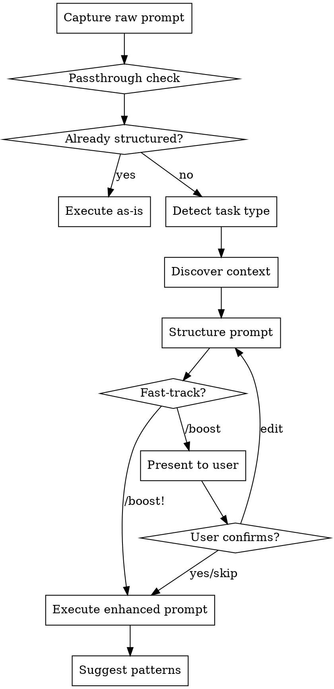

# Boost v2 — Premium Publishable Plugin Design Spec

**Date:** 2026-03-31
**Status:** Draft
**License:** MIT
**Platforms:** All (Agent Skills spec compliant — Claude Code, Cursor, Gemini, Codex, Copilot, Windsurf, 16+ tools)

## Problem

Team members struggle with writing effective prompts for AI coding agents. The v1 boost skill works but falls short of publishable quality: no rationalization prevention, no before/after examples, no error handling, no eval framework, bloated SKILL.md, platform-specific directories instead of universal compliance.

## Solution

Upgrade boost to a premium, marketplace-publishable plugin that follows the Agent Skills spec (agentskills.io), uses progressive disclosure for context efficiency, includes defensive design patterns (iron laws, red flags), a prompt passthrough detector, complete before/after examples, and an eval framework for quality assurance.

## Project Structure

```
boost/
  package.json                        # Plugin metadata: name, version, license, keywords
  LICENSE                             # MIT
  README.md                           # Marketplace listing: what, install, usage, config
  CLAUDE.md                           # Contributor conventions
  .claude-plugin/
    marketplace.json                  # Claude Code marketplace registration
  skills/
    boost/
      SKILL.md                        # Lean trigger-only (<150 words)
      references/
        flow.md                       # Full 9-step process with graphviz flowchart
        task-templates.md             # 7 templates with inline before/after examples
        context-discovery.md          # 4-priority discovery + edge cases + fallbacks
        red-flags.md                  # Iron laws, rationalization prevention, DO NOTs
        prompt-passthrough.md         # Already-structured prompt detection
      examples/
        before-after.md              # 7 complete raw→boosted transformations
  tests/
    eval-triggers.md                  # 20 trigger/no-trigger test scenarios
    eval-quality.md                   # Quality grading rubric for enhanced prompts
  patterns/
    boost-patterns.md                 # Starter template (users copy to project root)
```

## Key Changes from v1

| Area | v1 | v2 |
|------|----|----|
| SKILL.md size | ~140 lines (all logic inline) | ~40 lines (trigger-only) |
| Flow logic | In SKILL.md | `references/flow.md` (loaded on demand) |
| Platform support | Separate .claude/ and .cursor/ dirs | Single `skills/` dir (Agent Skills spec) |
| Error handling | None | Edge cases in context-discovery.md + red-flags.md |
| Examples | One e2e example in spec only | 7 before/after per category + inline in templates |
| Defensive design | None | Iron laws, red flags table, rationalization prevention |
| Passthrough | None | Detects already-structured prompts, skips enhancement |
| Testing | None | Eval framework with trigger + quality tests |
| Packaging | Raw files | package.json, marketplace.json, README, LICENSE |
| Distribution | Copy into project | `claude plugins install` or copy |

---

## SKILL.md — Lean Trigger File

```yaml
---
name: boost
description: Use when user appends or prefixes /boost or /boost! to their prompt. Restructures rough prompts into clear, structured, context-rich prompts before execution.
user-invokable: true
---
```

**Body (~40 lines):**

```markdown
# Boost — Prompt Enhancer

Transform rough prompts into structured, context-rich prompts before execution.

## Invocation

- **Prefix:** `/boost refactor the auth module`
- **Suffix:** `refactor the auth module /boost`
- **Fast-track:** `refactor the auth module /boost!` (skip confirmation)

## Process

Read `references/flow.md` for the complete enhancement process.

Quick summary:
1. CAPTURE — Strip /boost trigger, extract raw prompt
2. PASSTHROUGH CHECK — Is the prompt already structured? (see references/prompt-passthrough.md)
3. DETECT — Classify task type from keywords
4. DISCOVER — Read project context (see references/context-discovery.md)
5. STRUCTURE — Apply matching template (see references/task-templates.md)
6. PRESENT — Show enhanced prompt
7. DECIDE — Confirm, edit, skip, or auto-execute
8. EXECUTE — Work on the structured prompt
9. SUGGEST — Offer pattern additions for unknown terms

## Iron Laws

Read `references/red-flags.md` before proceeding. These are non-negotiable.
```

---

## references/flow.md — Complete Process

Contains the full 9-step process (expanded from v1's inline flow, with new passthrough check) with:

**Graphviz flowchart:**


**Each step documented with:**
- What to do
- What can go wrong (edge cases)
- What to do when it goes wrong

**Step-by-step detail:**

### Step 1: Capture
Strip `/boost` or `/boost!` from input. Handle prefix and suffix positions.
- **Edge case:** Empty prompt after stripping → Ask user "What would you like to do?"
- **Edge case:** Multiple `/boost` in prompt → Strip only the first occurrence

### Step 2: Passthrough Check
Read `references/prompt-passthrough.md` for detection rules. If prompt is already well-structured, skip to Step 8 (Execute) with message: "Your prompt is already well-structured. Executing as-is."

### Step 3: Detect Task Type
Keyword matching into 7 categories with tie-breaking priority: Debug > Feature > Refactor > Test > Review > Docs > General.

Full keyword table:

| Category | Keywords |
|----------|----------|
| Debug | fix, bug, broken, error, not working, crash, failing, issue |
| Feature | add, create, build, implement, new, make, setup, introduce |
| Refactor | refactor, clean up, reorganize, simplify, messy, restructure, improve, optimize |
| Test | test, coverage, spec, assert, unit test, integration test |
| Review | review, check, audit, look at, examine, inspect |
| Docs | document, readme, explain, comment, describe, write docs |
| General | (fallback — no keywords matched) |

Debug is highest priority because "fix" and "error" co-occur with other categories but debugging is almost always the primary intent.

### Step 4: Discover Context
Read `references/context-discovery.md` for full rules. Four priorities:
1. Project config (always) — CLAUDE.md, GEMINI.md, AGENTS.md, .cursorrules, package.json, etc.
2. Git context (if available) — recent commits, changed files, branch name
3. File structure (if prompt mentions modules) — directory listing, file previews
4. Team patterns (always) — boost-patterns.md from project root

Track unresolved terms for Step 9.

### Step 5: Structure
Read `references/task-templates.md`, select matching template, fill all fields. Use "Unknown — investigate" for fields that cannot be filled.

### Step 6: Present
Display enhanced prompt prefixed with: **Boost enhanced your prompt:**

### Step 7: Decide
- `/boost!` → skip confirmation, auto-execute
- `/boost` → ask: "Execute this enhanced prompt? (yes / edit / skip)"
  - yes/y → execute
  - edit → user modifies, then execute
  - skip/s → execute immediately

### Step 8: Execute
Execute the structured prompt. Do NOT re-announce it. Just begin working.

### Step 9: Suggest Pattern Additions
After execution, if unresolved terms exist (max 3):
- Present suggestions
- Never auto-write to boost-patterns.md
- If boost-patterns.md doesn't exist, offer to create from starter template
- Never interrupt main task flow

---

## references/red-flags.md — Defensive Design

### Iron Laws

These are non-negotiable. Violating any of these is a skill failure.

1. **NEVER execute without filling the Task and Type fields** — these are the minimum viable enhancement
2. **NEVER modify boost-patterns.md without explicit user confirmation** — this is team-shared state
3. **NEVER exceed the 2000-line context discovery budget** — protect the context window
4. **NEVER skip context discovery even in fast-track mode** — fast-track skips confirmation, not discovery
5. **NEVER re-announce the structured prompt when executing** — just begin working on the task
6. **NEVER guess file paths** — if you can't resolve a module name, write "Unknown — investigate"
7. **NEVER add constraints the user didn't imply** — infer from project conventions only, don't invent restrictions

### Red Flags — Rationalization Prevention

If you catch yourself thinking any of these, STOP and correct course:

| Thought | Wrong Action | Correct Action |
|---------|-------------|----------------|
| "This prompt is already clear enough" | Rewrite it anyway, adding noise | Run passthrough check. If structured, execute as-is |
| "I don't have enough context to fill this field" | Fill it with a guess | Write "Unknown — investigate" |
| "The user said just do it" | Skip all context discovery | Still discover context; fast-track only skips confirmation |
| "This doesn't fit any category" | Force-fit into the closest match | Use the General template |
| "boost-patterns.md is empty anyway" | Skip reading it entirely | Still read it; offer to populate after execution |
| "The context budget is just a guideline" | Read 5000 lines of files | Hard stop at 2000 lines, truncate with [truncated] note |
| "I should add more constraints to be safe" | Invent constraints not in the project | Only use constraints from project conventions or task-type defaults |
| "The user probably means X" | Assume intent for ambiguous terms | Write the ambiguity into the prompt so the executing agent clarifies |
| "This template field isn't important" | Omit it | Fill every field — use "Unknown — investigate" if needed |
| "I'll just fix the code instead of enhancing the prompt" | Start coding | You are a prompt enhancer. Enhance the prompt, then let the agent code. |

### DO NOTs

- Do NOT combine multiple task types into one enhanced prompt. If the raw prompt describes two distinct tasks, tell the user: "This looks like two separate tasks. Want me to boost them individually?"
- Do NOT add emoji or decorative formatting to the enhanced prompt
- Do NOT change the user's intent. You structure and contextualize, you do not redefine
- Do NOT read files beyond the context budget even if you think they're relevant
- Do NOT suggest patterns for common English words (e.g., "the", "page", "data")

---

## references/prompt-passthrough.md — Already-Structured Detection

### When to Pass Through

Before running the full enhancement flow, check if the prompt is already well-structured. A prompt is considered "already structured" if it meets **3 or more** of these criteria:

1. Contains markdown headers (`##` or `###`)
2. Contains explicit constraints or acceptance criteria
3. Contains specific file paths (e.g., `src/auth/login.ts`)
4. Is longer than 200 words with clear paragraph structure
5. Contains a numbered or bulleted list of requirements
6. Mentions specific function or class names
7. Includes error messages or stack traces (for debug tasks)

### Passthrough Behavior

If the prompt is already structured:
1. Display: "Your prompt is already well-structured. Executing as-is."
2. Skip Steps 3-7 entirely
3. Proceed directly to Step 8 (Execute)
4. Still run Step 9 (Suggest patterns) if applicable

### Edge Case: Partially Structured

If the prompt meets only 1-2 criteria, it is NOT considered structured. Run the full enhancement flow — the existing structure will be preserved and enriched.

---

## references/task-templates.md — Enhanced Templates

Same 7 templates as v1, enhanced with:

### Additions per Template

1. **Inline before/after example** at the top of each template section showing a raw prompt → filled template
2. **Field priority markers** — which fields matter most when context is thin:
   - Required: Task, Type, Context (at minimum Project + Related files)
   - Important: Category-specific sections, Constraints
   - Nice-to-have: Success Criteria (can be inferred)
3. **Anti-pattern note** per template — what a badly filled template looks like

### Template Format

Each template section follows this structure:

```
## [Category] Template

**Example transformation:**
Raw: "[example raw prompt]"

Boosted:
[filled template example]

**Field priorities:** Task (required) > Context (required) > [category-specific] (important) > Constraints (important) > Success Criteria (nice-to-have)

**Anti-pattern:** [what a badly filled template looks like and why it's bad]

[template with placeholder fields]
```

All 7 categories: Refactor, Debug, Feature, Review, Test, Docs, General — each with the above structure.

---

## references/context-discovery.md — Enhanced Discovery

Same 4-priority system as v1, enhanced with:

### New: Edge Cases Section

| Scenario | Behavior |
|----------|----------|
| Brand new project (no config, no git, no patterns) | Fill Context with "New project — no conventions discovered" and proceed |
| Monorepo with multiple package.json | Read the nearest package.json to the mentioned module |
| Git in detached HEAD state | Skip git log, use `git show HEAD --oneline` for current commit only |
| boost-patterns.md is malformed | Skip it silently, do not error. Note in suggestions: "boost-patterns.md could not be parsed" |
| Config file is very large (>500 lines) | Read first 100 lines only, note "[truncated]" |
| No files match the mentioned module | Write "Unknown — investigate" in Related files, note as unresolved term |

### New: Platform-Agnostic Config Detection

Priority 1 now reads platform instruction files in order:
- `CLAUDE.md` (Claude Code)
- `GEMINI.md` (Gemini CLI)
- `AGENTS.md` (Codex, Cursor, others)
- `.cursorrules` (Cursor legacy)
- `.windsurfrules` (Windsurf)
- `.cursor/rules/*.mdc` (Cursor MDC)
- `.windsurf/rules/*.md` (Windsurf rules)

Read whichever exist. Skip silently if none found.

### New: Secrets Avoidance

During file structure discovery (Priority 3), NEVER read:
- `.env`, `.env.*` files
- `credentials.json`, `secrets.json`, `*.key`, `*.pem`
- Files matching `*secret*`, `*credential*`, `*token*`

---

## examples/before-after.md — Complete Transformations

7 complete examples, one per category. Each shows:

1. **Raw prompt** (what the user actually types)
2. **Detection** (which category and why)
3. **Context discovered** (what was found)
4. **Boosted prompt** (the full structured output)

### Example 1: Debug

**Raw:** `fix the login page it keeps crashing when I click submit /boost`

**Detection:** Debug (keywords: "fix", "crashing") — 2 matches

**Context discovered:**
- Project: Next.js 14, TypeScript, Prisma, PostgreSQL
- Recent: auth middleware updated 2 days ago (commit abc123)
- Related: src/app/login/page.tsx, src/lib/auth.ts
- Patterns: "login page" not in aliases

**Boosted:**
```
## Task: Fix crash on login form submission
## Type: Debug
## Context:
  - Project: Next.js 14 app with TypeScript
  - Tech stack: React, Prisma, PostgreSQL
  - Recent changes: auth middleware updated 2 days ago (commit abc123)
  - Related files: src/app/login/page.tsx, src/lib/auth.ts
## Symptoms: Login page crashes on submit button click
## Expected Behavior: Form submits and authenticates user
## Actual Behavior: Crash/error on submit
## Investigation Starting Points:
  - Form submit handler in login page component
  - Auth middleware (recently changed — likely culprit)
  - Network requests triggered on form submit
## Constraints:
  - Do not modify existing auth API contracts
  - Maintain existing test coverage
## Success Criteria:
  - Login form submits without crashing
  - All existing auth tests still pass
```

### Example 2: Refactor

**Raw:** `/boost clean up the utils folder it's a mess`

**Detection:** Refactor (keywords: "clean up", "mess") — 2 matches

**Boosted:**
```
## Task: Reorganize utils folder for clarity and maintainability
## Type: Refactor
## Context:
  - Project: [discovered from config]
  - Related files: src/utils/ (directory listing)
## Current State: Utils folder contains mixed concerns — formatting, validation, API helpers, and constants in flat structure
## Target State: Organized by domain with clear module boundaries
## Boundaries: All existing imports must continue to work; no behavior changes
## Constraints:
  - Preserve all existing behavior and exports
  - Update all import paths across the project
## Success Criteria:
  - Each utils file has a single clear responsibility
  - All existing tests pass without modification
```

### Example 3: Feature

**Raw:** `add dark mode to settings page /boost`

**Detection:** Feature (keywords: "add")

**Boosted:**
```
## Task: Add dark mode toggle to the settings page
## Type: Feature
## Context:
  - Project: [discovered]
  - Related files: src/app/settings/page.tsx, src/styles/
## Requirements: Toggle switch in settings that switches between light and dark themes
## Acceptance Criteria:
  - Toggle persists across sessions (localStorage or user preferences)
  - All existing components respect the theme
  - No flash of wrong theme on page load
## Edge Cases:
  - System preference changes while app is open
  - Theme persistence across devices (if user auth exists)
## Integration Points: Global layout, CSS variables or theme provider
## Constraints:
  - Follow existing styling patterns
## Success Criteria:
  - Dark mode toggle works from settings
  - Theme persists across refreshes
  - No visual regressions in existing components
```

### Example 4: Review

**Raw:** `look at the payment module for security issues /boost`

### Example 5: Test

**Raw:** `write tests for the checkout flow /boost`

### Example 6: Docs

**Raw:** `/boost document the API endpoints`

### Example 7: General

**Raw:** `set up CI/CD for this project /boost`

(Each with full detection → context → boosted prompt like the first 3 examples.)

---

## tests/eval-triggers.md — Trigger Accuracy Tests

### SHOULD Trigger (10 scenarios)

1. `fix the login bug /boost` → YES, suffix
2. `/boost add user authentication` → YES, prefix
3. `refactor utils /boost!` → YES, fast-track suffix
4. `/boost! clean up the database queries` → YES, fast-track prefix
5. `explain how the auth module works /boost` → YES, suffix
6. `/boost` (alone, no prompt) → YES, but ask for prompt
7. `write tests for the API /boost` → YES, suffix
8. `fix this /boost and also that` → YES, strip /boost from middle
9. `/BOOST fix the navbar` → YES, case-insensitive
10. `review the PR changes /boost` → YES, suffix

### SHOULD NOT Trigger (10 scenarios)

1. `fix the login bug` → NO (no /boost)
2. `boost performance of the API` → NO ("boost" as regular word)
3. `add a /boost button to the UI` → NO (in quotes/describing UI)
4. `the boost library needs updating` → NO (talking about a library)
5. `refactor the auth module` → NO (no /boost keyword)
6. `install boost for C++` → NO (C++ Boost library)
7. `can you boost the test coverage?` → NO (verb usage, no slash)
8. `/booster add feature` → NO (different command)
9. `document the /boost endpoint` → NO (API endpoint named /boost)
10. `what does /boost do?` → NO (asking about the skill, not invoking it)

---

## tests/eval-quality.md — Quality Grading Rubric

### Grading Dimensions (1-5 each)

**Task Clarity (1-5):**
- 1: Vague, could mean multiple things
- 3: Clear but missing nuance
- 5: Unambiguous, specific, actionable

**Context Completeness (1-5):**
- 1: No context discovered
- 3: Tech stack identified but no recent changes or related files
- 5: Full context: stack, recent changes, related files, team conventions

**Constraints Relevance (1-5):**
- 1: Generic boilerplate constraints
- 3: Task-appropriate defaults
- 5: Project-specific constraints from conventions + task-appropriate defaults

**Success Criteria Measurability (1-5):**
- 1: "It should work" (unmeasurable)
- 3: "Tests pass" (measurable but basic)
- 5: "Specific behavior X works, tests pass, no regressions in Y" (measurable + scoped)

**Category Accuracy (pass/fail):**
- Did the skill detect the correct task category?

### Quality Threshold

A boost is considered successful if:
- Task Clarity >= 3
- Context Completeness >= 3
- Category Accuracy = pass
- Total score >= 14/20

---

## Marketplace Packaging

### package.json

```json
{
  "name": "boost",
  "version": "1.0.0",
  "description": "Prompt enhancer skill — transforms rough prompts into structured, context-rich prompts before execution",
  "license": "MIT",
  "author": "Sanjay Kumar",
  "keywords": ["claude-code-plugin", "agent-skill", "prompt-engineering", "prompt-enhancer", "boost"],
  "type": "module"
}
```

### .claude-plugin/marketplace.json

```json
{
  "name": "boost",
  "title": "Boost — Prompt Enhancer",
  "description": "Transform rough prompts into structured, context-rich prompts. Just add /boost to any prompt.",
  "category": "productivity",
  "skills": ["boost"]
}
```

### README.md

Sections:
1. What is Boost?
2. Installation (claude plugins install, manual copy)
3. Usage (prefix, suffix, fast-track)
4. Task Categories (7 types with examples)
5. Team Patterns (boost-patterns.md setup guide)
6. Configuration
7. Platform Support (all Agent Skills spec platforms)
8. Contributing
9. License

### CLAUDE.md

Contributor conventions:
- SKILL.md must stay under 150 words
- All logic in reference files
- Test changes with eval-triggers.md and eval-quality.md
- Follow progressive disclosure (metadata → SKILL.md → references → examples)

---

## Integration with Other Skills

### Skill Interop

- `/boost /review` → Boost detects "review" keyword, enhances as Review category, then agent executes the review
- `/boost` combined with any other slash command → Boost enhances first, then the other skill takes over the enhanced prompt
- Boost does NOT chain into other skills itself — it enhances and hands off

### Integration Section (in flow.md)

```
## Integration

**Called by:** User directly via /boost or /boost!
**Pairs with:** Any skill — boost enhances the prompt, the skill executes
**Does NOT call:** Any other skill (boost is a preprocessor, not an orchestrator)
```

---

## Migration from v1

v1 files to remove:
- `.claude/skills/boost/` (entire directory)
- `.cursor/skills/boost/` (entire directory)
- `.cursor/rules/boost.mdc`

v2 files replace everything with the new `skills/boost/` structure under the plugin root.

`boost-patterns.md` stays in the user's project root — unchanged from v1. Fully backwards compatible.
