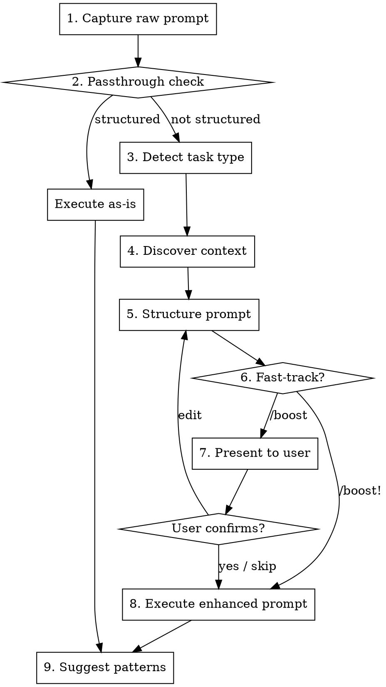

# Boost — Complete Process

## Flow



## Step 1: Capture

Strip `/boost` or `/boost!` from the user's input. The remaining text is the raw prompt.

- If `/boost!` was used → fast-track mode ON (skip confirmation in Step 7)
- If `/boost` was used → fast-track mode OFF (show confirmation)
- Handle both prefix and suffix positions
- Case-insensitive: `/BOOST`, `/Boost` all work

**Edge cases:**
- Empty prompt after stripping → Ask: "What would you like to do?"
- Multiple `/boost` in prompt → Strip only the first occurrence
- `/boost` appears as part of a word (e.g., `/booster`) → Do NOT trigger

## Step 2: Passthrough Check

Read `references/prompt-passthrough.md` for detection rules.

If the prompt is already well-structured (meets 3+ criteria), skip to Step 8 with message:

"Your prompt is already well-structured. Executing as-is."

If partially structured (1-2 criteria), run the full enhancement flow — existing structure will be preserved and enriched.

## Step 3: Detect Task Type

Scan the raw prompt for keywords (case-insensitive):

| Category | Keywords |
|----------|----------|
| Debug | fix, bug, broken, error, not working, crash, failing, issue |
| Feature | add, create, build, implement, new, make, setup, introduce |
| Refactor | refactor, clean up, reorganize, simplify, messy, restructure, improve, optimize |
| Test | test, coverage, spec, assert, unit test, integration test |
| Review | review, check, audit, look at, examine, inspect |
| Docs | document, readme, explain, comment, describe, write docs |
| General | (fallback — no keywords matched) |

**Detection rules:**
- Count keyword matches per category (case-insensitive)
- Highest count wins
- Tie-breaking priority: Debug > Feature > Refactor > Test > Review > Docs > General
- Debug is highest because "fix" and "error" co-occur with other categories but debugging is almost always the primary intent

**Edge case:** If the raw prompt describes two distinct tasks (e.g., "fix the login bug and add dark mode"), tell the user: "This looks like two separate tasks. Want me to boost them individually?"

## Step 4: Discover Context

Read `references/context-discovery.md` for the full discovery rules.

**Quick summary — 4 priorities:**
1. **Project config** (always) — instruction files, package manifests, style configs
2. **Git context** (if available) — recent commits, changed files, branch name
3. **File structure** (if prompt mentions modules) — directory listing, file previews
4. **Team patterns** (always) — boost-patterns.md from project root

Stay within ~2000 line budget.

**Track unresolved terms** for Step 9: module/component names that could not be resolved to file paths or aliases.

## Step 5: Structure the Prompt

Read `references/task-templates.md` and select the template matching the detected task type.

Fill in every field:
- **Task:** Rewrite the raw prompt as a clear one-line summary
- **Type:** The detected category name
- **Context:** Populate from discovered project context
- **Category-specific sections:** Fill using raw prompt + discovered context
- **Constraints:** Combine project conventions + task-type defaults
- **Success Criteria:** Derive measurable outcomes from the task

If a field cannot be filled → write "Unknown — investigate" (never omit, never guess).

## Step 6: Present

Display the enhanced prompt prefixed with:

**Boost enhanced your prompt:**

## Step 7: Decide

**Fast-track ON** (`/boost!`): Skip confirmation, proceed to Step 8.

**Fast-track OFF** (`/boost`): Ask: "Execute this enhanced prompt? (yes / edit / skip)"
- **yes / y** → proceed to Step 8
- **edit** → user modifies, incorporate changes, proceed to Step 8
- **skip / s** → proceed to Step 8 immediately (mid-flow fast-track)

## Step 8: Execute

Execute the structured prompt as if the user had typed it directly.

**IMPORTANT:** Do NOT re-announce the prompt. Just begin working on the task.

## Step 9: Suggest Pattern Additions

After execution completes, if unresolved terms exist (from Step 4):

1. Collect up to 3 unresolved terms
2. Present:
   ```
   Boost noticed terms it could add to your team patterns:
     - "[term]" — what does this refer to? (file path, module, service?)
   Want me to add these to boost-patterns.md?
   ```
3. **Never auto-write** — always ask first
4. If confirmed, append to the appropriate section
5. If boost-patterns.md doesn't exist, offer to create from starter template in `patterns/boost-patterns.md`
6. Max 3 suggestions per invocation
7. Never interrupt the main task — suggestions come AFTER execution only
8. If declined, do not ask again for the same terms in this session

## Integration

**Called by:** User directly via /boost or /boost!
**Pairs with:** Any skill — boost enhances the prompt, the other skill executes
**Does NOT call:** Any other skill (boost is a preprocessor, not an orchestrator)

`/boost /review` → Boost detects "review" keyword, enhances as Review category, then agent executes
`/boost` + any other command → Boost enhances first, other skill takes over the enhanced prompt

---

Commit: `git add skills/boost/references/flow.md && git commit -m "feat(boost): add complete 9-step flow with flowchart and edge cases"`
